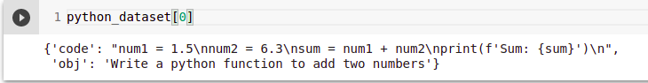
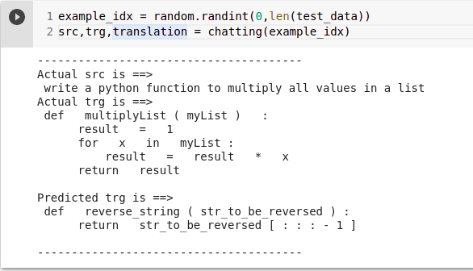

# Python code generator using Transformer

## Dataset Preparation:
1. The dataset used is ##makedataset and the script for preprocessing the data is used is ##preprocessing
2. The dataset is processed using pygments tokenizer library. https://pygments.org/
3. spaces are considered as indentation
4. 'code' is decoder input 'obj' is encoder input

## Glove training:
1. The dataset used is [Raw Python Code Corpus](https://figshare.com/articles/dataset/Raw_Python_Code_Corpus/11777217) , I have randomly chosen 5000 files outof 68k python files to create a corpus.
2. The corpus is processed using pygments tokenizer.
3. The training notebook could be found here [Glove training](https://figshare.com/articles/dataset/Raw_Python_Code_Corpus/11777217)
4. This glove embedding is used in the transformer decoder embedding.

## Transformer training:
1. The transformer uses pretrained glove embedding
2. loss function is default ce loss
3. The training and inference script could be found here [Transformer training]()

## Sample Output:

## Next steps:
1. Try training glove embedding on bigger python corpus maybe
2. Maybe try different loss function